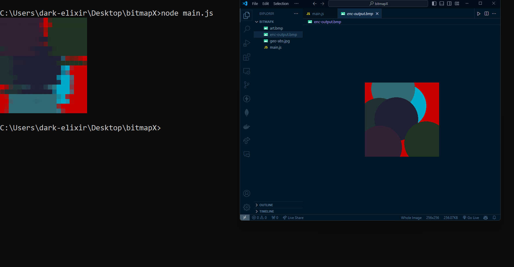

```markdown
# BMP Image Terminal Viewer

This project demonstrates how to read, parse, downscale, and display BMP images in a terminal using Node.js.

## Features

- **Read BMP File:** Reads a BMP image file synchronously.
- **Parse BMP Header:** Extracts header information from the BMP file.
- **Extract Pixel Data:** Extracts pixel RGB data from the BMP file.
- **Downscale Image:** Resizes the image to fit within terminal dimensions.
- **Display in Terminal:** Displays the downscaled image using ANSI escape codes.

## Usage

### Prerequisites

- Node.js installed on your machine.

### Installation

1. Clone the repository:

   ```bash
   git clone <repository_url>
   cd bmp-image-terminal-viewer
```

2. Install dependencies:

   ```bash
   npm install
   ```

### Running the Program

Replace `enc-output.bmp` with your BMP image file name in `index.js` if necessary.

Run the program:

```bash
node main.js
```

### Example

Below is an example of how the program displays a BMP image in the terminal:

![Terminal Screenshot](terminal-screenshot.png)

## Contributing

Contributions are welcome! Please fork the repository and submit pull requests.
"# EchoPixel" 
